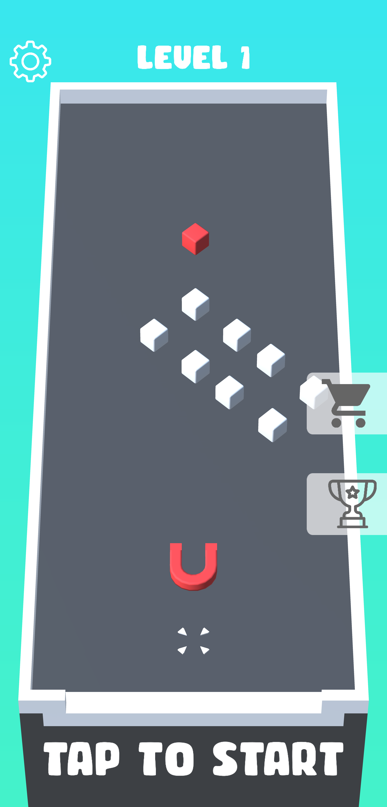

# Hasan Zeki Göğebakan
## About
A creative game developer who creates dazzling addictive games.
With over 2 years of experience in the gaming industry.
## Skills
- ### Game Programming
  - C#
  - Python
  - OOP
- ### Game Engine
  - Unity
  - Build Box
- ### Augmented Reality
  - Vuforia AR
  - AR Core
- ### 3D Modelling
  - 3Ds Max
  - Blender
- ### 2D
  - Adobe Photoshop
- ### Other
  - Creativity
  - Scheduling
  - Group Presentations
  - Time Management
  - Effective Communication
  - Be able to think simple and analyze problems easily
  - Creating a new mechanism for mobile games
  - Wide-ranging knowledge of gaming trends
  - Ability to work as part of a team
### Ongoing Game Projects
## Merge Magnet
|               |               |       |
| ------------- |:-------------:| -----:|
|  |  |  |
|  |  |  |
### Contact
- Mail: hsnzkg@gmail.com
- LinkedIn: www.linkedin.com/in/hsnzkg

